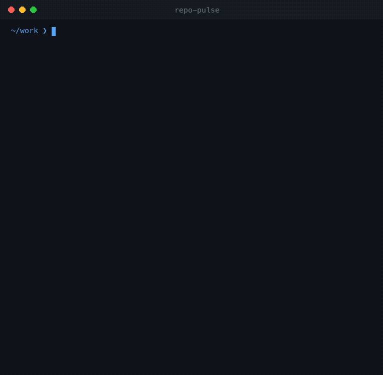

<h1 align="center">Hritik Datta</h1>

<p align="center">
  <b>Product @ <a href="https://github.com/pre6ai">Pre6 AI</a></b> &nbsp;·&nbsp; I build production-grade AI agent systems.
</p>

<p align="center">
  <i>Product by title, builder by craft — I design AI products and ship the engineering behind them:
  multi-agent orchestration, agent evaluation, and AI safety infrastructure.</i>
</p>

<p align="center">
  
  
  
</p>

---

### What I work on

I care about the unglamorous half of AI products — the part that decides whether they survive contact with real users.
Most demos route a single LLM call. Production systems need orchestration, evaluation, safety gates, and observability.
That gap is what I build into.

- **Multi-agent orchestration** — supervisor/specialist architectures with typed state, tool binding, and streaming traces.
- **Agent reliability** — measurable, auditable evaluation of agent runs across reliability, safety, latency, and cost.
- **LLM safety** — scanning retrieval context for prompt injection, secret leakage, PII, and exfiltration before it reaches a model.
- **Developer tooling** — sharp CLIs that turn fuzzy engineering signals into decisions teams can act on.

---

### Featured work

| Project | What it is | Stack | Links |
|---|---|---|---|
| **[gemma4-multi-agent](https://github.com/Hritikd/gemma4-multi-agent)** | Production-ready multi-agent system — a Supervisor routes work across 4 specialist agents with live reasoning traces and sandboxed tool execution. | Python · LangGraph · Gemini · Streamlit | [Code](https://github.com/Hritikd/gemma4-multi-agent) |
| **[rag-safety-gateway](https://github.com/Hritikd/rag-safety-gateway)** | AI security gateway that scans RAG context for prompt injection, secrets, PII, and exfiltration risk, producing deterministic allow/redact/quarantine decisions. | TypeScript · React · CI | **[Live Demo](https://hritikd.github.io/rag-safety-gateway/)** · [Code](https://github.com/Hritikd/rag-safety-gateway) |
| **[agent-evals-lab](https://github.com/Hritikd/agent-evals-lab)** | Evaluation workbench for agent reliability — typed scoring engine, policy rules, regression detection, and a trace-inspection dashboard. | TypeScript · React · CI | **[Live Demo](https://hritikd.github.io/agent-evals-lab/)** · [Code](https://github.com/Hritikd/agent-evals-lab) |
| **[repo-pulse](https://github.com/Hritikd/repo-pulse)** | CLI that turns any Git repo into an engineering-health report — churn × complexity hotspot scoring you can paste into a review. | Python | [Code](https://github.com/Hritikd/repo-pulse) |
| **[contract-watch](https://github.com/Hritikd/contract-watch)** | CLI that diffs two OpenAPI contracts and flags breaking API changes before they reach clients. CI-friendly. | TypeScript | [Code](https://github.com/Hritikd/contract-watch) |
| **[ai-code-reviewer](https://github.com/Hritikd/ai-code-reviewer)** | Structured AI code review from the terminal — severity-rated, line-specific feedback in pretty / JSON / Markdown. | Python | [Code](https://github.com/Hritikd/ai-code-reviewer) |

Every project ships with tests, CI, and documentation — and the AI tooling runs without API keys so anyone can review it in under a minute.

<p align="center">
  
  <br/>
  <sub><b>repo-pulse</b> in action — a real, unedited run, no keys or config.</sub>
</p>

---

### How I build

```text
Typed contracts first   →  domain models before logic, so behavior is auditable
Deterministic by default →  scoring and decisions reproducible without a live model
Measurable, then pretty  →  evals and telemetry before dashboards
Reviewable in 60 seconds →  clone, run, understand — no API keys to start
```

---

### Stack

`Python` · `TypeScript` · `LangGraph` · `LangChain` · `React` · `Streamlit` · `Google Gemini` · `OpenAI` · `pytest` · `Vitest` · `GitHub Actions` · `uv`

---

<p align="center">
  <a href="https://www.linkedin.com/in/hritikdatta/"></a>
  <a href="https://x.com/hritikd05"></a>
  <a href="mailto:hritikdatta2403@gmail.com"></a>
</p>

<p align="center"><sub>Open to conversations on AI agent engineering, evals, and LLM safety.</sub></p>
